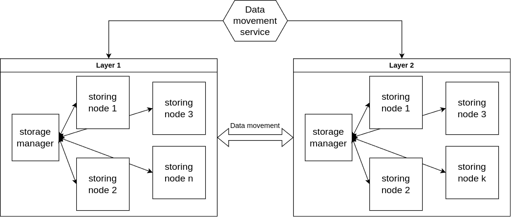

# dcachelayer
Parts of multi layer system build based on dcache

MVP of a hierarchical storage system. This solution is based on kubernetes cluster and serves as "caching layer". There are two layers in this implementation of the system. And there is one "data movement" service to integrate those independent layers. 

This project can be used to build multi layer architecture. Each layer works as an independent entity through protocols which are being virtualized by data movement service.

In the end this MVP has a structure like:
